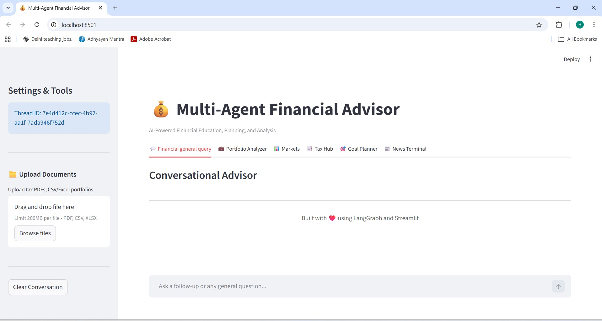

# 💰 AI Finance Assistant

A modular, Multi-Agent Financial Advisor system powered by LangGraph, OpenAI, and Streamlit. This application leverages a team of specialized AI agents to provide comprehensive financial planning, market analysis, news synthesis, tax education, and portfolio review.

## 🚀 App Screenshot


## 🚀 Features

-   **Multi-Agent Architecture**: Routes user queries to the most relevant specialist agent (General Finance, Market Analysis, News, Tax, Goal Planning, or Portfolio Analysis).
-   **RAG (Retrieval-Augmented Generation)**: Uses a vector database (ChromaDB) to ground answers in verified financial knowledge (Zerodha Varsity).
-   **Real-time Data**: Integrates with `yfinance` for stock market data and `Tavily` for web search.
-   **Portfolio Analysis**: Analyzes live Zerodha portfolio and uploaded CSV/Excel/PDF portfolios.
-   **Financial Tools**: Includes calculators for SIP, Inflation, and Tax (via Python logic).
-   **Document Analysis**: Upload PDF documents for the Tax Agent to analyze.
-   **Interactive UI**: A rich Streamlit interface with dedicated tabs for different financial activities.

---

## 📂 Project Structure

The codebase is organized into a modular `src/` directory:

```
ai_finance_assistant/
├── src/
│   ├── agents/          # 🤖 Specialized Agent Modules
│   │   ├── fqaa_agent.py   # Finance Q&A Agent (General queries & RAG)
│   │   ├── maa_agent.py    # Market Analysis Agent (Stocks, Technicals)
│   │   ├── paa_agent.py    # Portfolio Analysis Agent (Holdings Review)
│   │   ├── nsa_agent.py    # News Synthesizer Agent (News & Sentiment)
│   │   ├── tea_agent.py    # Tax Education Agent (Tax laws & Calcs)
│   │   └── gpa_agent.py    # Goal Planning Agent (Financial Planning)
│   │
│   ├── core/            # ⚙️ Core Configuration
│   │   └── llm.py          # Centralized LLM (GPT-4o) initialization
│   │
│   ├── data/            # 📚 Data Sources
│   │   └── urls.py         # List of URLs for the Knowledge Base
│   │
│   ├── rag/             # 🧠 Knowledge Engine
│   │   └── rag_engine.py   # Vectorstore setup, Embeddings, & Retriever
│   │
│   ├── utils/           # 🛠️ Shared Utilities
│   │   └── tools.py        # Tools: yfinance, Calculators, PDF Reader, CSV Reader, Tavily
│   │
│   ├── web_app/         # 💻 User Interface
│   │   └── app.py          # Main Streamlit Application
│   │
│   └── workflow/        # 🔄 Orchestration
│       ├── state.py        # Shared State definition (LangGraph)
│       └── graph.py        # Main Workflow Graph & Router Logic
│
├── config.yaml          # Configuration settings
├── requirements.txt     # Python dependencies
└── README.md            # Documentation
```

---

## 🛠️ Setup & Installation

### Prerequisites
- Python 3.10+
- API Keys: `OPENAI_API_KEY`, `TAVILY_API_KEY`, `NEWSDATA_API_KEY` (Optional)

### Installation Steps

1.  **Clone the Repository**
    ```bash
    git clone <repository_url>
    cd ai_finance_assistant
    ```

2.  **Create a Virtual Environment (Optional but Recommended)**
    ```bash
    python -m venv venv
    source venv/bin/activate  # On Windows: venv\Scripts\activate
    ```

3.  **Install Dependencies**
    ```bash
    pip install -r requirements.txt
    ```

4.  **Configure Environment Variables**
    Create a `.env` file in the root directory:
    ```env
    OPENAI_API_KEY=your_openai_api_key
    TAVILY_API_KEY=your_tavily_api_key
    NEWSDATA_API_KEY=your_newsdata_api_key
    ```

---

## ▶️ Running the Application

To launch the web interface, run the following command from the project root:

```bash
streamlit run src/web_app/app.py
```

The application will open in your default web browser at `http://localhost:8501`.

---

## � How Each Agent Helps You

This system is built like a **Financial Team**, where each agent has a specific role. Here is how you can use them:

| Agent | Role | Best Feature | How to Use |
| :--- | :--- | :--- | :--- |
| **FQAA** (Finance Q&A) | **The Educator** | Explains complex jargon simply. | Ask "What is a mutual fund?", "Explain futures vs options." |
| **PAA** (Portfolio Analysis) | **The Strategist** | Analyzes your portfolio like Warren Buffett. | **Upload your holdings (CSV/Excel)** and ask "Analyze my portfolio." |
| **MAA** (Market Analysis) | **The Analyst** | Real-time stock data & technicals. | Ask "Price of HDFC Bank", "Is RELIANCE bullish or bearish?" |
| **TEA** (Tax Education) | **The CA** | Tax saving & document review. | **Upload a tax notice (PDF)** and ask "Summarize this tax document." |
| **GPA** (Goal Planning) | **The Planner** | Creates investment roadmaps. | Ask "Plan for ₹5Cr retirement corpus in 20 years." |
| **NSA** (News Synthesizer) | **The Reporter** | Curates market news. | Ask "Latest news on EV sector", "Sentiment for IT stocks." |

---

## 🖥️ UI Description & Functionalities

The application is divided into **6 functional tabs**, each serving a specific purpose:

### 1. 💬 Conversational Advisor (General Query)
-   **Purpose**: Ask general financial questions.
-   **Powered By**: **FQAA**.
-   **Features**: Uses RAG to answer from internal knowledge base (Zerodha Varsity).

### 2. 💼 Portfolio Analyzer (Buffett/Graham Style)
-   **Purpose**: Review and optimize your investment portfolio dynamically.
-   **Powered By**: **PAA** (Portfolio Analysis Agent).
-   **Features**:
    -   **Dual Mode Analysis**: Analyze static uploaded files OR connect contextually to live brokerage accounts.
    -   **Live Brokerage Integration (Zerodha Kite)**: Utilizes the Model Context Protocol (MCP) to securely fetch real-time holdings, positions, and margins directly from your Zerodha Kite account.
    -   **File Upload**: Supports **CSV, Excel, and PDF** uploads for offline portfolio reviews.
    -   **Deep Analysis**: Evaluates diversification, sector allocation, and individual stock fundamentals.
    -   **Actionable Advice**: Gives specific "Buy", "Sell", "Hold" recommendations based on value investing principles.
    -   *Validation Examples*:
        -   *Offline upload*: `"Analyze my uploaded CSV portfolio and tell me if it is well-diversified."`
        -   *Live MCP connection*: `"Analyze my live Zerodha portfolio."` or `"Connect to my Kite account and review my current holdings."`

### 3. 📊 Markets (Real-time Insights)
-   **Purpose**: Get stock prices, technical analysis, and market trends.
-   **Powered By**: **MAA** (Market Analysis Agent).
-   **Features**:
    -   **Ticker Input**: Enter symbols like `RELIANCE.NS` or `TSLA`.
    -   Fetches real-time price, volume, and changes.
    -   Provides technical (RSI, MA) and fundamental insights.
    -   *Validation Examples*: `"Analyze Tata Motors"`, `"Current price of AAPL"`.

### 4. 📑 Tax Hub (Education & Docs)
-   **Purpose**: Understand tax laws and analyze financial documents.
-   **Powered By**: **TEA**.
-   **Features**:
    -   **Document Upload**: Upload PDF/Text files (e.g., P&L statements, tax notices).
    -   **Analysis**: Summarizes tax implications and calculates liabilities.

### 5. 🎯 Goal Planner (Financial Planning)
-   **Purpose**: Plan for life goals (Retirement, Education, etc.).
-   **Powered By**: **GPA**.
-   **Features**:
    -   **Goal Form**: Input Target Amount, Years, and Return %.
    -   **Roadmap Generator**: Creates a detailed month-by-month investment plan (SIP).

### 6. 📰 News Terminal
-   **Purpose**: Catch up on financial news and sentiment.
-   **Powered By**: **NSA**.
-   **Features**:
    -   **Topic Search**: Enter a company name or keyword.
    -   Synthesizes news from multiple sources.
    -   Provides "Impact Analysis" (Short/Mid/Long term) and "Sentiment" (Bullish/Bearish).
    -   *Example*: "Latest news on RBI policy", "HDFC Bank sentiment".

---

## 🤖 Workflow Architecture

1.  **Router**: Analyzes the user's intent from the query.
2.  **Routing**: directing the query to the specific agent (`FQAA`, `PAA`, `MAA`, `TEA`, `GPA`, `NSA`).
3.  **Agent Execution**: The selected agent executes its logic (RAG, Tools, Web Search).
4.  **Response**: The agent returns a structured markdown response which is displayed in the UI.

User Query ➡️ **Router** ➡️ **Specialist Agent** ➡️ **Tools/RAG** ➡️ **Response**
